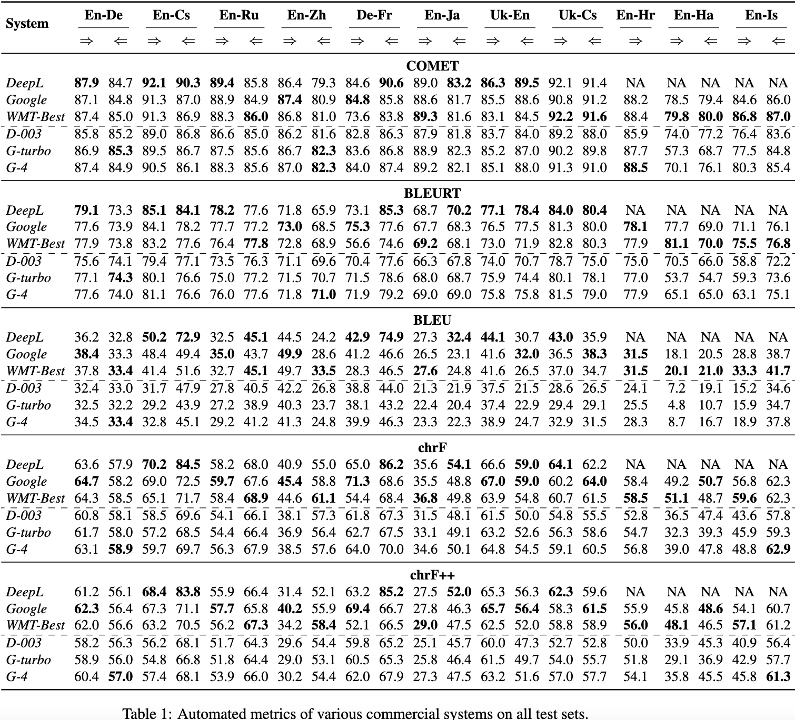

# LLM-MT-Eval

This repo evaluates

* DeepL
* Google Trans
* WMT22 Best
* text-davinci-003
* gpt-3.5-turbo-0301
* gpt-4-0314

in automatic metrics:

* COMET
* BLEURT
* BLEU
* chrF
* chrF++

 on WMT22 general translation tasks:

* English<->German
* English<->Czech
* English<->Russian
* English<->Chinese
* German<->French
* English<->Japanese
* Ukrainian<->English
* Ukrainian<->Czech
* English->Croatian.

### Results

