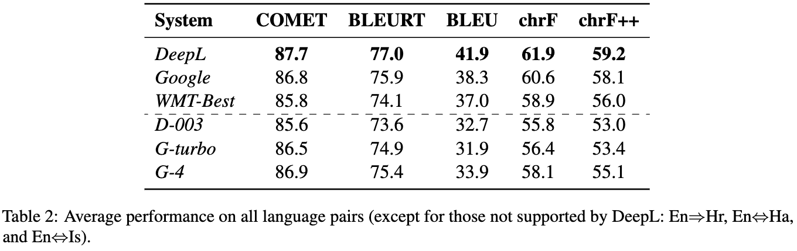
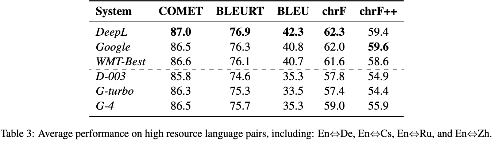
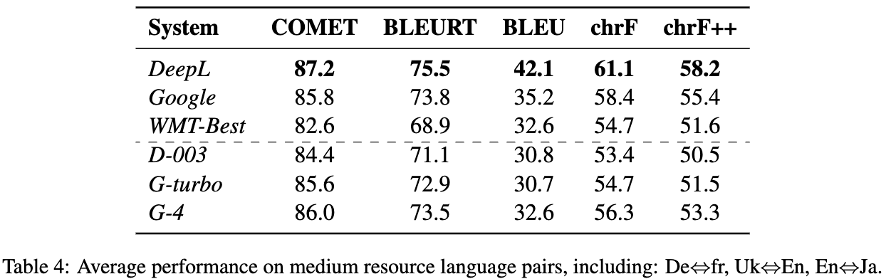

# LLM-MT-Eval

This repo evaluates

* DeepL
* Google Trans
* WMT22 Best
* text-davinci-003
* gpt-3.5-turbo-0301
* gpt-4-0314

in automatic metrics:

* COMET
* BLEURT
* BLEU
* chrF
* chrF++

 on WMT22 general translation tasks:

* English<->German
* English<->Czech
* English<->Russian
* English<->Chinese
* German<->French
* English<->Japanese
* Ukrainian<->English
* Ukrainian<->Czech
* English->Croatian

and WMT21 news translation tasks:

* English<->Hausa
* English<->Icelandic


### Results

#### System outputs

```
output/
|-- deepl
|-- google-cloud
|-- gpt-3.5-turbo-0301
|-- gpt-4-0314
|-- text-davinci-003
`-- wmt-winner
```

#### Full results

<p align="center">

</p>


#### **Average performance**

**All language pairs** （except for those not supported by DeepL）

<p align="center">

</p>

**High resource**

* En<->De, En<->Cs, En<->Ru, En<->Zh

<p align="center">

</p>

**Medium resource**

* De<->Fr, En<->Uk, En<->Ja

<p align="center">

</p>

**Low resource**

* Uk<->Cs, En<->Hr, En<->Ha, En<->Is

<p align="center">

</p>

### Evaluation

```sh
wget https://storage.googleapis.com/bleurt-oss-21/BLEURT-20.zip .
unzip BLEURT-20.zip
python3 evaluation/eval.log --bleurt-ckpt BLEURT-20
```
